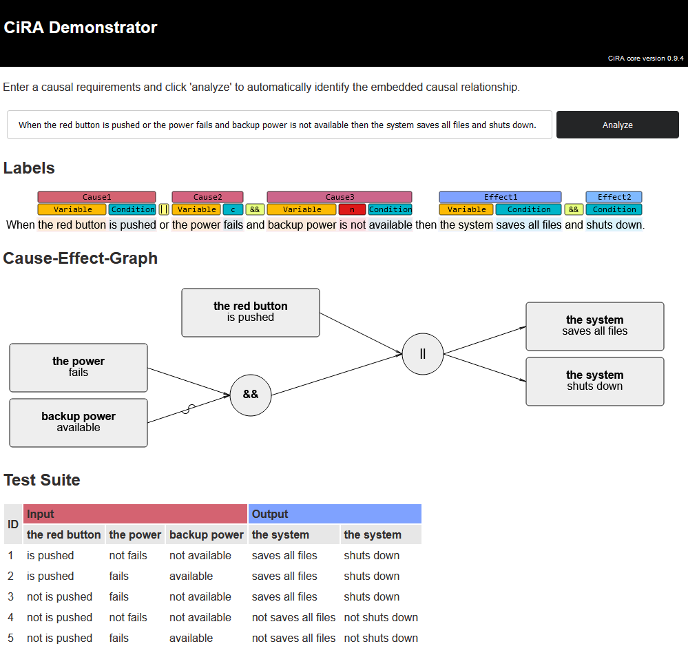

# CiRA User Interface 

## Summary of Artifact

This repository contains a web-based application which provides a user interface for the [CiRA functionality](https://github.com/JulianFrattini/cira).

## Usage

The CiRA UI is built on top of a `core`, which implements the CiRA functionality and exposes it via a REST-ful API, and a `frontend` providing a graphical user interface. To use the CiRA UI, make sure to have [docker](https://www.docker.com/) installed, which takes care of setting up both the `core` and the `frontend`. 

Once docker is installed, run `docker-compose up` in this folder. The setup will take a while as docker will pull an existing image for the `core` from the [core CiRA repository](https://github.com/JulianFrattini/cira/pkgs/container/cira).

## Development

In order to work on the CiRA UI, you need to instantiate a valid [backend](#backend) before starting the [frontend](#frontend).

### Backend

For the backend, you can either use the [actual CiRA core](#actual-core) or a [mocked base](#mocked-core).

#### Actual Core

Make sure that you have [docker](https://www.docker.com/) installed.

1. Obtain the latest image of the [CiRA core](https://github.com/JulianFrattini/cira/pkgs/container/cira).
2. Start the container based on this CiRA core.

#### Mocked Core

This repository provides a mocked core for quick development of the UI.

1. Make sure to have [Python 3.10](https://www.python.org/downloads/release/python-3100/) and [pip](https://pypi.org/project/pip/) installed.
2. Install the backend requirements by running `pip install -r requirements.txt` (either globally or in a virtual environment).
3. Start the mocked backend via `python mockapp.py` from the backend folder.

This will open a mocked server on localhost with port 8000. This mocked server can only process the sentences that are statically given in the [sentences folder](./static/sentences/).

### Frontend

To start the frontend, make sure you have [Node.js](https://nodejs.org/en/download/) and [npm](https://www.npmjs.com/) available. Execute `npm install` and then `npm run start` from the frontend folder.

## License

Copyright © 2023 Julian Frattini

This work (source code) is licensed under  [Apache License Version 2.0](./LICENSE).